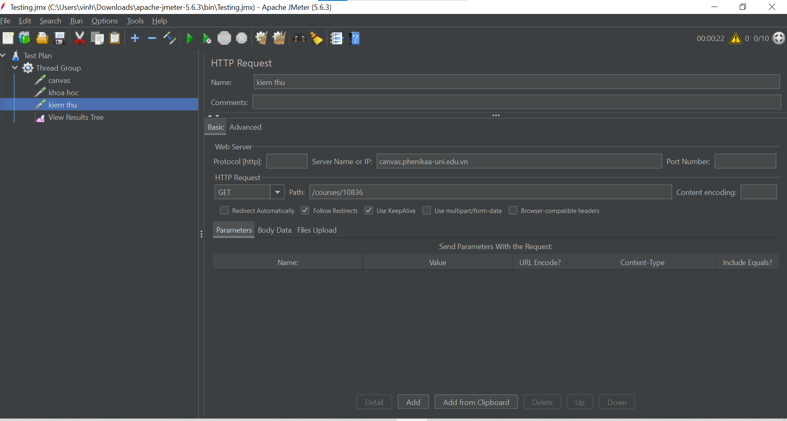

## jmeter-Load-Testing

# Mục tiêu:
    - Giới thiệu các khái niệm cơ bản về jMeter.
    - Hướng dẫn sinh viên cách sử dụng jMeter để thực hiện các bài kiểm tra hiệu năng đơn giản.
    - Giúp sinh viên hiểu cách phân tích kết quả kiểm tra và đưa ra kết luận. 
# Mô tả bài tập
    - Bài tập nhằm giới thiệu các khái niệm cơ bản về jMeter và hướng dẫn sinh viên cách sử dụng jMeter để thực hiện các bài kiểm tra hiệu năng đơn giản.
## Kịch bản kiểm tra
## Thread Group
    - Number of Threads: 10
    - Ramp-Up Period(seconds): 2
    - Loop Count: 10

### 1. Kiểm tra `canvas.phenikaa-uni.edu.vn`
- 

### 2. Kiểm tra `canvas.phenikaa-uni.edu.vn/courses`
- 

### 3. Kiểm tra `/courses/`
- 

### 4. View Results Tree
- 
## Kết quả in ra loading.csv
- 